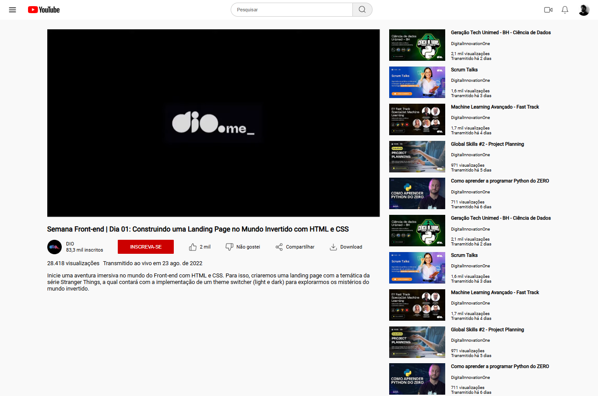

[<< Voltar](https://github.com/EnricoABM/desafios-css)

# Clonando a Página do Youtube com CSS

<div align="center">
    
</div>


# Sobre

Este projeto consiste na estilização de uma página do YouTube, aplicando os conceitos aprendidos sobre o módulo `flexbox` do CSS e suas propriedades relacionadas.  

O desafio faz parte do módulo **Trabalhando com Layouts no CSS** da formação **CSS Web Developer** na plataforma [DIO](https://www.dio.me/).

[Descrição Oficial do Desafio](https://www.figma.com/file/lrRWUZPKnqMDZrSDJmZxUS/Desafio-de-Flexbox---DIO?node-id=0%3A1)

## Tecnologias utilizadas


 

# Como executar esse desafio

1. Baixe o repositório em sua máquina.
    ```bash
    git clone https://github.com/EnricoABM/desafios-css
    ```

2. Acesse a pasta deste desafio.
    ```bash
    cd desafios-css/desafio-flexbox
    ```

3. Abra o arquivo `index.html` em um navegador para a página ser carregada.
    ```bash
    ./project/index.html
    ```