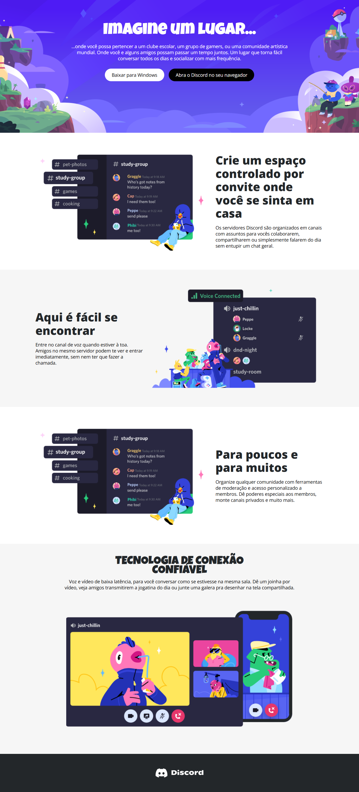

[<< Voltar](https://github.com/EnricoABM/desafios-css)

# Construindo um Layout Responsivo Para o Site do Discord Com CSS

<div align="center">
    
</div>

# Sobre

Este projeto consiste na aplicação dos conceitos de responsividade, utilizando de `Media Querries` e alteração do layout para comportar o acesso de usuários por Desktops e Smartphones.


O desafio faz parte do módulo **Trabalhando com Layouts no CSS** da formação **CSS Web Developer** na plataforma [DIO](https://www.dio.me/).

[Descrição Oficial do Desafio](https://www.figma.com/design/NRBYrG5d4DSzObv7dpTqoM/Desafio-Responsividade---DIO?node-id=1-2&node-type=frame&t=L1MHst9EnpKwoG5N-0)

## Tecnologias utilizadas


# Como executar esse desafio

1. Baixe o repositório em sua máquina.

    ```bash
    git clone https://github.com/EnricoABM/desafios-css
    ```

2. Acesse a pasta deste desafio.

    ```bash
    cd desafios-css/desafio-responsividade
    ```

3. Abra o arquivo `index.html` em um navegador para a página ser carregada.
    ```bash
    ./project/index.html
    ```
